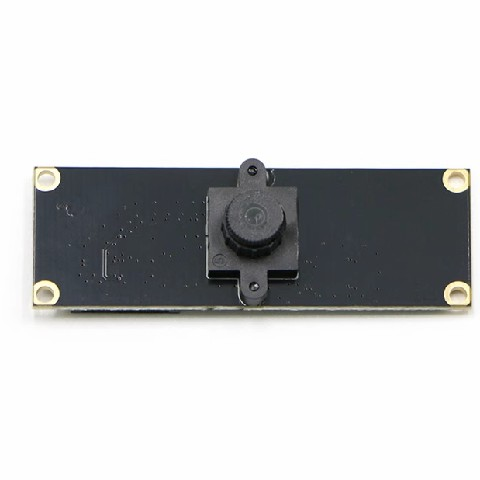
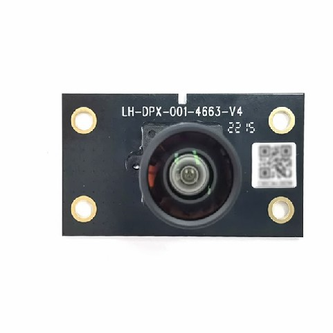
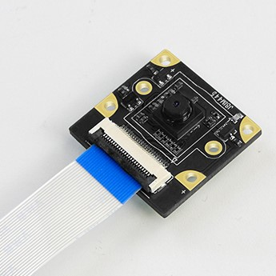
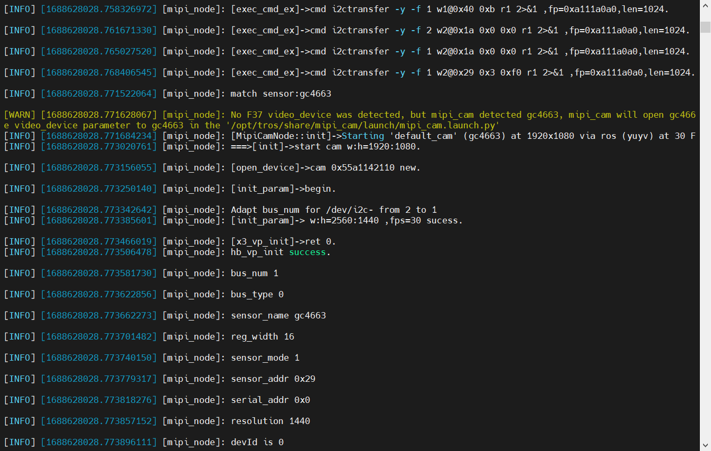
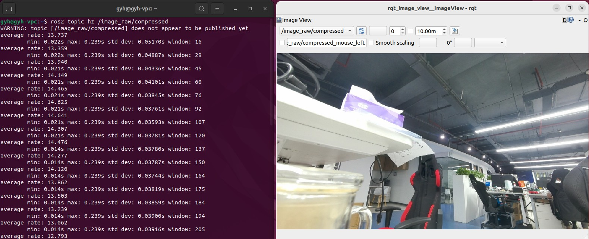

# 功能介绍
MIPI（移动行业处理器接口）是Mobile Industry Processor Interface的缩写，针对摄像头、显示屏、射频/基带等接口进行了标准化定义，从而减少终端设备的复杂度、增加设计的灵活性。

该Node提供的主要功能是基于RDK套件MIPI接口的摄像头驱动，可以轻松抓取MIPI相机的视频流数据，并且发布ROS标准的图像数据，供其他Node订阅。除此之外，该Node还支持发布共享内存形式的图像数据，提高RDK端侧图像传输的效率。


# 支持相机

| 序号 | 名称   | 示意图片                    | 参数     | 参考链接                                                     |
| ---- | ------ | --------------------------- | -------- | ------------------------------------------------------------ |
| 1    | F37    |        | 200W像素 | [F37](https://detail.tmall.com/item.htm?abbucket=12&id=683310105141&ns=1&spm=a230r.1.14.28.1dd135f0wI2LwA&skuId=4897731532963) |
| 2    | GC4663 |  | 400W像素 | [GC4663](https://detail.tmall.com/item.htm?abbucket=12&id=683310105141&ns=1&spm=a230r.1.14.28.1dd135f0wI2LwA&skuId=4897731532963) |
| 3    | IMX219 |  | 800W像素 | [IMX219](https://detail.tmall.com/item.htm?abbucket=9&id=710344235988&rn=259e73f46059c2e6fc9de133ba9ddddf&spm=a1z10.5-b-s.w4011-22651484606.159.55df6a83NWrGPi) |


# 使用方法

## 功能安装

在RDK系统的终端中运行如下指令，即可快速安装：

```bash
sudo apt install -y tros-mipi-cam
```


## 启动相机

在RDK系统的终端中运行如下指令，可使用默认相机配置，自适应启动已连接的相机：

```
source /opt/tros/setup.bash
ros2 run mipi_cam mipi_cam
```



### 调整分辨率

启动过程中允许调整输出的图像分辨率，启动命令后直接跟如下参数即可：

```bash
source /opt/tros/setup.bash
ros2 run mipi_cam mipi_cam --ros-args -p image_width:=960 -p image_height:=540
```


### 调整编码方式

启动过程中允许调整输出图像（/image_raw）的编码方式，默认bgr8编码方式，支持修改为nv12编码方式，例如发布960x540分辨率的nv12格式图像：

````bash
source /opt/tros/setup.bash
ros2 run mipi_cam mipi_cam --ros-args -p out_format:=nv12 -p image_width:=960 -p image_height:=540
````


### 调整传输方式

启动过程中允许调整图像的传输方式，默认通过ROS话题传输，支持修改为基于共享内存零拷贝方式的传输，使用io_method参数进行设置，设置后发布的图像话题名称为：hbmem_img：

````bash
source /opt/tros/setup.bash
ros2 run mipi_cam mipi_cam --ros-args -p io_method:=shared_mem
````

**注意：**

基于共享内存的方式只适用于RDK单板卡内部使用，无法用于分布式传输。


### 设置标定文件

使用 camera_calibration_file_path 参数设置相机标定文件路径，此处以使用GC4663相机并读取config文件下的GC4663_calibration.yaml为例(打印信息见下方Attention)：

```bash
# config中为示例使用的相机标定文件，根据实际安装路径进行拷贝
source /opt/tros/setup.bash
ros2 run mipi_cam mipi_cam --ros-args -p camera_calibration_file_path:=./config/GC4663_calibration.yaml -p video_device:=GC4663
```


## 图像可视化

可在同一网络的PC端利用rqt_image_view工具查看发布的实时图像：

```bash
ros2 run rqt_image_view rqt_image_view
```


## 图像压缩

以上相机驱动后发布的图像数据均为未经压缩的原始图像，相对资源消耗较多，如需使用图像压缩，可使用ROS中的image_transport_plugins实现，使用前需要先进行安装：

```bash
sudo apt-get install ros-foxy-image-transport-plugins
```

在第一个终端中启动相机：

```bash
source /opt/tros/setup.bash
ros2 run mipi_cam mipi_cam --ros-args -p image_width:=960 -p image_height:=540
```

新启动一个终端，运行图像压缩：

```bash
source /opt/ros/foxy/setup.bash
ros2 run image_transport republish raw compressed --ros-args --remap in:=/image_raw --remap out/compressed:=/image_raw/compressed
```

运行以上指令后，就可以在同一网络的PC端使用rqt_image_view看到压缩后的图像了，明显可以感受到图像传输更加流畅了。



**注意：**

为了提高DDS图像传输的效率，建议将RDK上运行的DDS更换为cyclonedds，更换方法请参考常见问题中的“如何更换DDS”。


# 接口说明


## 话题

| 名称         | 消息类型                             | 说明                                     |
| ------------ | ------------------------------------ | ---------------------------------------- |
| /camera_info | sensor_msgs/msg/CameraInfo           | 相机内参话题，根据设置的相机标定文件发布 |
| /image_raw   | sensor_msgs/msg/Image                | 周期发布的图像话题，rgb8格式             |
| /hbmem_img   | rcl_interfaces/msg/HobotMemoryCommon | 基于共享内存share mem的图像话题，        |

## 参数

| 名称                         | 参数值                                          | 说明                                               |
| ---------------------------- | ----------------------------------------------- | -------------------------------------------------- |
| video_device                 | 自适应（默认）<br />F37<br />GC4663<br />IMX415 | 相机设备号，支持自适应适配                         |
| image_width                  | 1920（默认）                                    | 和使用的相机有关                                   |
| image_height                 | 1080（默认）                                    | 和使用的相机有关                                   |
| out_format                   | bgr8（默认）<br />nv12                          | 图像编码方式                                       |
| io_method                    | 无（默认）<br />shared_mem                      | 图像传输方式，配置shared_mem后将使用零拷贝机制传输 |
| camera_calibration_file_path | 无（默认）                                      | 相机标定文件的路径                                 |


# 常见问题
1. **使用不同的相机需要设置不同的video_device参数么**

    不需要，该Node支持相机自适应，如果使用“支持相机”章节中列出的相机型号，运行时会自动适配。

2. **如何更换DDS**

    ROS2 Foxy默认使用的是fastdds，在图像传输的场景下，会受到限制，此时我们可以切换为cyclonedds。

    - 安装cyclonedds

      ```
      sudo apt install ros-foxy-rmw-cyclonedds-cpp
      ```

    - 切换使用的dds

      ```
      export RMW_IMPLEMENTATION=rmw_cyclonedds_cpp
      ```

      cyclonedds默认会绑定某一网卡进行数据传输，如果需要切换绑定的网卡，可以继续在该终端中输入：

      ```
      export CYCLONEDDS_URI='<CycloneDDS><Domain><General><NetworkInterfaceAddress>wlan0</NetworkInterfaceAddress></General></Domain></CycloneDDS>'
      ```

      中间的参数就是绑定网卡的名字，按照实际需要，修改为eth0、wlan0，或者实际的网卡设备号。[参考链接](http://www.robotandchisel.com/2020/08/12/cyclonedds/)

3. **图像传输慢，上位机看到的图像有卡顿**

      主要有两种解决方案：

      （1）将DDS更换为cyclonedds：参考“如何更换DDS”进行操作

      （2）使用压缩后的图像做传输：参考使用方法中的“图像压缩与解压缩”，先将图像压缩后再传输到PC端使用。
