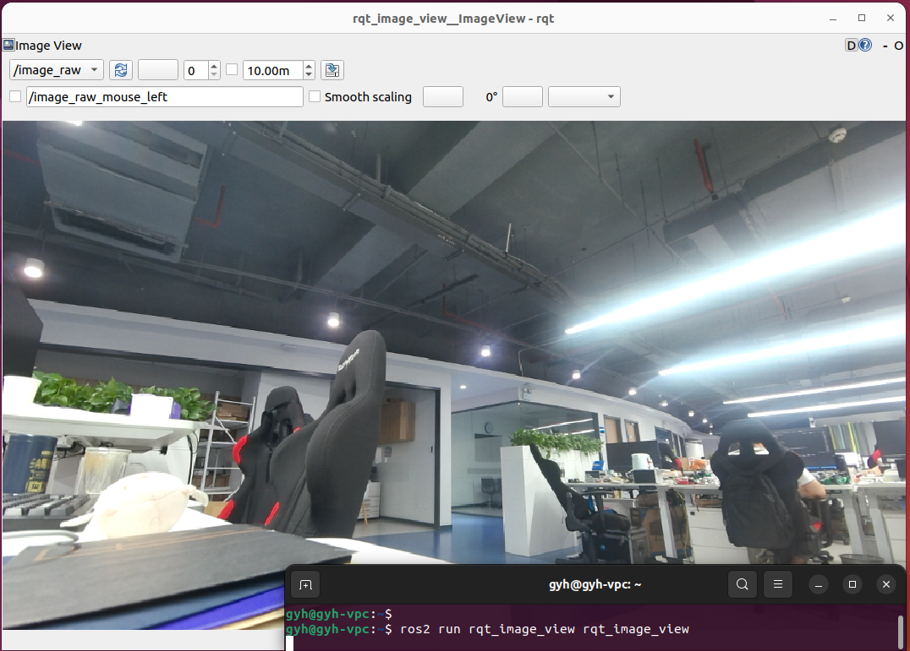

# 功能介绍
MIPI（移动行业处理器接口）是Mobile Industry Processor Interface的缩写，针对摄像头、显示屏、射频/基带等接口进行了标准化定义，从而减少终端设备的复杂度、增加设计的灵活性。

该Node提供的主要功能是基于RDK套件MIPI接口的摄像头驱动，可以轻松抓取MIPI相机的视频流数据，并且发布ROS标准的图像数据，供其他Node订阅。除此之外，该Node还支持发布共享内存形式的图像数据，提高RDK端侧图像传输的效率。

目前支持F37、IMX415、GC4663、IMX219、IMX477、OV5647等MIPI相机。


# 支持相机

| 序号 | 名称   | 示意图片                    | 参数     | 参考链接                                                     |
| ---- | ------ | --------------------------- | -------- | ------------------------------------------------------------ |
| 1    | F37    |        | 200W像素 | [F37](https://detail.tmall.com/item.htm?abbucket=12&id=683310105141&ns=1&spm=a230r.1.14.28.1dd135f0wI2LwA&skuId=4897731532963) |
| 2    | GC4663 |  | 400W像素 | [GC4663](https://detail.tmall.com/item.htm?abbucket=12&id=683310105141&ns=1&spm=a230r.1.14.28.1dd135f0wI2LwA&skuId=4897731532963) |
| 3    | IMX219 |  | 800W像素 | [IMX219](https://detail.tmall.com/item.htm?abbucket=9&id=710344235988&rn=259e73f46059c2e6fc9de133ba9ddddf&spm=a1z10.5-b-s.w4011-22651484606.159.55df6a83NWrGPi) |


# 使用方法

## 功能安装

在RDK系统的终端中运行如下指令，即可快速安装：

```bash
sudo apt install -y tros-mipi-cam
```


## 启动相机

在RDK系统的终端中运行如下指令，可使用默认相机配置，自适应启动已连接的相机：

```
source /opt/tros/setup.bash
ros2 run mipi_cam mipi_cam
```


### 调整分辨率

启动过程中允许调整输出的图像分辨率，启动命令后直接跟如下参数即可：

```bash
source /opt/tros/setup.bash
ros2 run mipi_cam mipi_cam --ros-args -p image_width:=960 -p image_height:=540
```


### 调整编码方式

启动过程中允许调整输出图像（/image_raw）的编码方式，默认bgr8编码方式，支持修改为nv12编码方式，例如发布960x540分辨率的nv12格式图像：

````bash
source /opt/tros/setup.bash
ros2 run mipi_cam mipi_cam --ros-args -p out_format:=nv12 -p image_width:=960 -p image_height:=540
````


### 调整传输方式

启动过程中允许调整图像的传输方式，默认通过ROS话题传输，支持修改为基于共享内存零拷贝方式的传输，使用io_method参数进行设置，设置后发布的图像话题名称为：hbmem_img：

````bash
source /opt/tros/setup.bash
ros2 run mipi_cam mipi_cam --ros-args -p io_method:=shared_mem
````

注意：基于共享内存的方式只适用于RDK单板卡内部使用，无法用于分布式传输。


### 设置标定文件

使用 camera_calibration_file_path 参数设置相机标定文件路径，此处以使用GC4663相机并读取config文件下的GC4663_calibration.yaml为例(打印信息见下方Attention)：

```bash
# config中为示例使用的相机标定文件，根据实际安装路径进行拷贝
source /opt/tros/setup.bash
ros2 run mipi_cam mipi_cam --ros-args -p camera_calibration_file_path:=./config/GC4663_calibration.yaml -p video_device:=GC4663
```


## 图像可视化

可在同一网络的PC端利用rqt_image_view工具查看发布的实时图像：

```bash
ros2 run rqt_image_view rqt_image_view
```




## 图像压缩与解压缩

以上相机驱动后发布的图像数据均为未经压缩的原始图像，先对资源消耗较多，如需使用图像压缩，可使用如下中继的方式：

```bash
ros2 run image_transport republish [in_transport] in:=<in_base_topic> [out_transport] out:=<out_base_topic>
```

例如：

```bash
ros2 run image_transport republish raw compressed --ros-args --remap in:=/image_raw --remap out/compressed:=/image_raw/compressed
```

运行成功后，会产生发布压缩图像的 compressed 话题，其他节点可订阅该话题，例如：

```bash
ros2 run image_subscribe_example subscribe_example --ros-args -p sub_img_topic:=/image_raw/compressed
```


**注意：**

此功能需要安装ROS中的image_transport_plugins功能包，安装命令如下：

```bash
sudo apt-get install ros-foxy-image-transport-plugins
```


# 接口说明

## 话题

| 名称         | 消息类型                             | 说明                                     |
| ------------ | ------------------------------------ | ---------------------------------------- |
| /camera_info | sensor_msgs/msg/CameraInfo           | 相机内参话题，根据设置的相机标定文件发布 |
| /image_raw   | sensor_msgs/msg/Image                | 周期发布的图像话题，rgb8格式             |
| /hbmem_img   | rcl_interfaces/msg/HobotMemoryCommon | 基于共享内存share mem的图像话题，        |

## 参数

| 名称                         | 参数值                                          | 说明                                               |
| ---------------------------- | ----------------------------------------------- | -------------------------------------------------- |
| video_device                 | 自适应（默认）<br />F37<br />GC4663<br />IMX415 | 相机设备号，支持自适应适配                         |
| image_width                  | 1920（默认）                                    | 和使用的相机有关                                   |
| image_height                 | 1080（默认）                                    | 和使用的相机有关                                   |
| out_format                   | bgr8（默认）<br />nv12                          | 图像编码方式                                       |
| io_method                    | 无（默认）<br />shared_mem                      | 图像传输方式，配置shared_mem后将使用零拷贝机制传输 |
| camera_calibration_file_path | 无（默认）                                      | 相机标定文件的路径                                 |


# 常见问题

