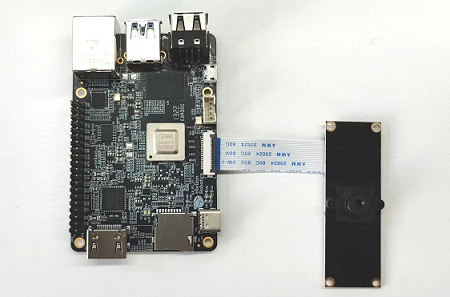
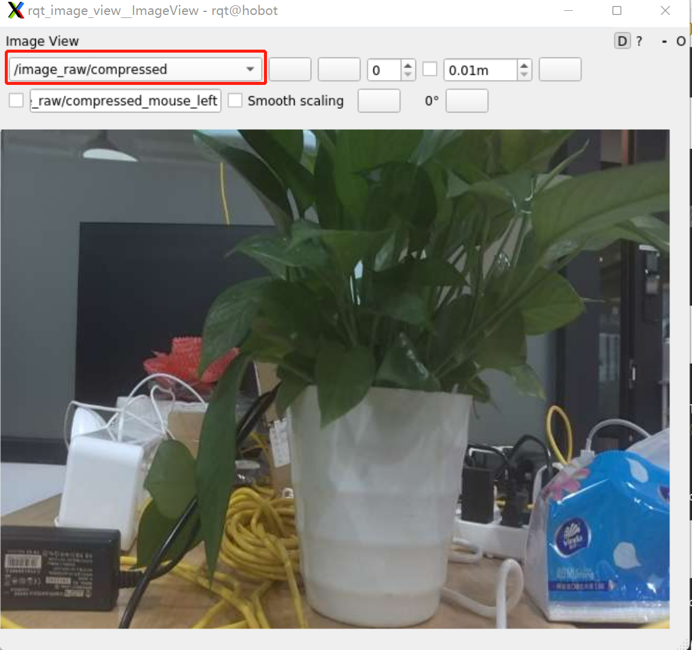
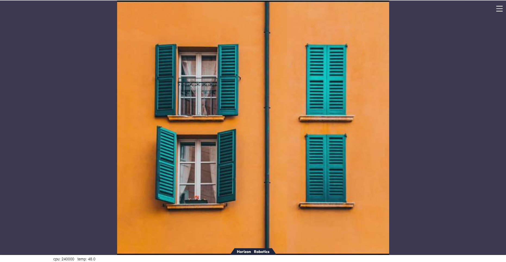

# 功能介绍

对已适配的MIPI接口摄像头进行配置，并将采集的图像数据以ROS标准图像消息或者零拷贝（hbmem）图像消息进行发布，供需要使用图像数据的其他模块订阅。

# 物料清单

当前已支持以下MIPI摄像头

| 序号 | 名称   | 示意图片                    | 参数     | 参考链接                                                     |
| ---- | ------ | --------------------------- | -------- | ------------------------------------------------------------ |
| 1    | F37    |        | 200W像素 | [F37](https://detail.tmall.com/item.htm?abbucket=12&id=683310105141&ns=1&spm=a230r.1.14.28.1dd135f0wI2LwA&skuId=4897731532963) |
| 2    | GC4663 |  | 400W像素 | [GC4663](https://detail.tmall.com/item.htm?abbucket=12&id=683310105141&ns=1&spm=a230r.1.14.28.1dd135f0wI2LwA&skuId=4897731532963) |
| 3    | IMX219 |  | 800W像素 | [IMX219](https://detail.tmall.com/item.htm?abbucket=9&id=710344235988&rn=259e73f46059c2e6fc9de133ba9ddddf&spm=a1z10.5-b-s.w4011-22651484606.159.55df6a83NWrGPi) |


# 使用方法

## 硬件连接

以F37摄像头为例，与RDK X3连接方式如下图：

  


## 功能安装

在RDK系统的终端中运行如下指令，即可快速安装：

```bash
sudo apt update
sudo apt install -y tros-mipi-cam
```

## 启动相机

在RDK系统的终端中运行如下指令，可使用默认相机配置，自适应启动已连接的相机：

```bash
# 配置 tros.b 环境：
source /opt/tros/setup.bash
# launch 方式启动
ros2 launch mipi_cam mipi_cam.launch.py
```
mipi_cam.launch.py配置默认输出960*544分辨率NV12图像，发布的话题名称为/hbmem_img

如需使用其他分比率或者图像格式可以使用对应的launch文件，比如：

- mipi_cam_640x480_bgr8.launch.py 提供640*480分辨率，BGR8格式的图像数据
- mipi_cam_640x480_bgr8_hbmem.launch.py 提供640*480分辨率，BGR8格式的零拷贝传输图像数据
- mipi_cam_640x480_nv12_hbmem.launch.py 提供640*480分辨率，NV12格式的零拷贝传输图像数据

如程序输出如下信息，说明节点已成功启动

```text
[INFO] [launch]: All log files can be found below /root/.ros/log/2022-06-11-15-16-13-641715-ubuntu-8852
[INFO] [launch]: Default logging verbosity is set to INFO
[INFO] [mipi_cam-1]: process started with pid [8854]
...
```

## 图像可视化

### 使用ROS rqt_image_view

这里采用rqt_image_view方式实现图像可视化，需要在PC端安装ROS2 Humble版本。由于发布的是原始数据，需要编码JPEG图像提高传输效率，另起一个终端用于订阅 MIPI 数据并编码为JPEG。

```shell
source /opt/tros/setup.bash
ros2 launch hobot_codec hobot_codec_encode.launch.py codec_out_format:=jpeg-compressed codec_pub_topic:=/image_raw/compressed
```

保证PC与RDK X3处于同一网段，以Foxy版本为例在PC上执行

```shell
# 配置ROS2环境
source /opt/ros/foxy/local_setup.bash
ros2 run rqt_image_view rqt_image_view
```

选择话题/image_raw/compressed,图像效果如下：



### 使用WEB浏览器

这里采用web端方式实现图像可视化，由于发布的是原始数据，需要编码JPEG图像，另起两个终端：一个进行订阅 MIPI 数据编码为JPEG，一个用于webservice发布。

 打开一个新的终端
```shell
source /opt/tros/local_setup.bash
# 启动编码
ros2 launch hobot_codec hobot_codec_encode.launch.py
```
另起一个终端
```shell
source /opt/tros/local_setup.bash
# 启动websocket
ros2 launch websocket websocket.launch.py websocket_image_topic:=/image_jpeg websocket_only_show_image:=true
```

PC打开浏览器（chrome/firefox/edge）输入<http://IP:8000>（IP为地平线RDK IP地址），点击左上方Web端展示即可看到MIPI摄像头输出的实时画面
    


# 接口说明


## 话题

### 发布话题
| 名称         | 消息类型                             | 说明                                     |
| ------------ | ------------------------------------ | ---------------------------------------- |
| /camera_info | sensor_msgs/msg/CameraInfo           | 相机内参话题，根据设置的相机标定文件发布 |
| /image_raw   | sensor_msgs/msg/Image                | 周期发布的图像话题，rgb8格式             |
| /hbmem_img   | rcl_interfaces/msg/HobotMemoryCommon | 基于共享内存share mem的图像话题，        |

## 参数

| 名称                         | 参数值                                          | 说明                                               |
| ---------------------------- | ----------------------------------------------- | -------------------------------------------------- |
| video_device                 | 自适应（默认）<br />F37<br />GC4663<br />IMX415 | 相机设备号，支持自适应适配                         |
| image_width                  | 1920（默认）                                    | 和使用的相机有关                                   |
| image_height                 | 1080（默认）                                    | 和使用的相机有关                                   |
| out_format                   | bgr8（默认）<br />nv12                          | 图像编码方式                                       |
| io_method                    | 无（默认）<br />shared_mem                      | 图像传输方式，配置shared_mem后将使用零拷贝机制传输 |
| camera_calibration_file_path | 无（默认）                                      | 相机标定文件的路径                                 |


# 常见问题

1. 使用不同的相机需要设置不同的video_device参数么

    不需要，该Node支持相机自适应，如果使用“支持相机”章节中列出的相机型号，运行时会自动适配。

2. 摄像头插拔注意事项

   **严禁在开发板未断电的情况下插拔摄像头，否则非常容易烧坏摄像头模组。**

3. 如遇到hobot_sensor节点启动异常，可通过下述步骤进行问题排查：
    - 检查硬件连接
    - 是否设置 tros.b 环境
    - 参数是否正确，具体参考 Hobot_Sensors README.md

4. 如遇到PC端ros2 topic list未识别到摄像头topic，做如下排查：

   - 检查地平线RDK是否正常pub图像

      ```shell
      source /opt/tros/setup.bash
      ros2 topic list
      ```

      输出：

      ```text
      /camera_info
      /hbmem_img000b0c26001301040202012020122406
      /image_raw
      /image_raw/compressed
      /parameter_events
      /rosout
      ```

   - 检查PC和地平线RDK网络能否ping通；
   - PC和地平线RDK IP地址是否前三位相同；